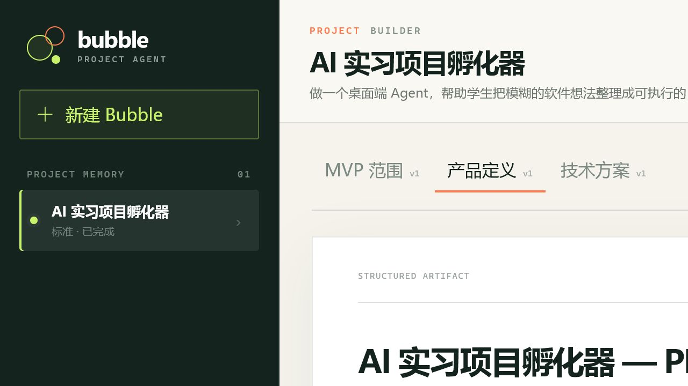
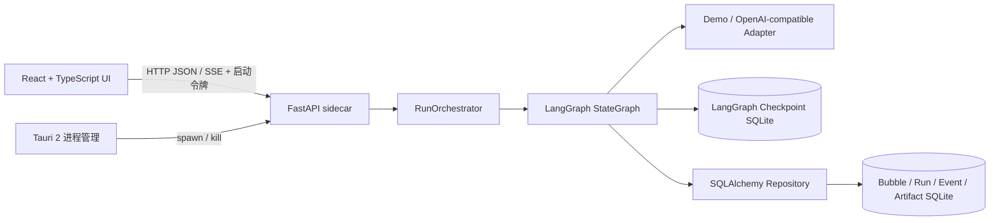

# Bubble Agent

一个本地优先、开发深度可控的桌面项目规划 Agent。用户输入模糊想法并选择 Spark、Builder 或 Architect，系统通过澄清、人工确认、发散收敛、结构化生成和 Critic 修订，产出可追踪的 PRD、MVP 与技术方案，并把它们保存在持续演进的 Bubble 中。



> 这是面向 Agent / Python 后端实习面试的个人项目。重点不是“又一个聊天框”，而是可恢复工作流、清晰的工程边界、可解释运行轨迹和可复现评测。

## 项目亮点

- **深度是真实执行策略**：三档深度会改变问题预算、LangGraph 分支、Critic 轮次、Token 预算和产物契约，而非只修改 Prompt。
- **Human-in-the-loop**：生成最终方案前使用 LangGraph `interrupt` 暂停，用户确认后从同一 `thread_id` 恢复。
- **发散—收敛—评审闭环**：Builder/Architect 先产生多个方向并评分收敛，再通过 Critic 定向修订。
- **双层持久化**：SQLAlchemy 业务表保存 Bubble、Run、Event、Artifact；LangGraph SQLite checkpointer 保存图执行状态。
- **可解释执行**：FastAPI 将节点开始、完成、失败、重试、人工确认等事件持久化，并通过 SSE 增量推送。
- **本地桌面交付**：Tauri 管理 PyInstaller sidecar 的启动和退出；后端只绑定回环地址，并使用每次启动随机生成的令牌鉴权。
- **可测而非只可演示**：9 个自动化测试覆盖三档路由、人工中断、鉴权、SSE、取消、导出与进程重启恢复；20 个离线评测样本的契约得分为 100%。

## 架构



核心图路径：

```text
normalize → depth policy → find gaps → interrupt(user)
  Spark:                         → MVP → draft → persist
  Builder/Architect: → diverge → converge → MVP → stack → draft
                                           → critic ↔ revise → persist
```

## 技术栈

| 层 | 技术 |
| --- | --- |
| Agent | LangGraph `StateGraph`、`interrupt`、`Command`、SQLite checkpointer |
| Python 后端 | FastAPI、Pydantic v2、SQLAlchemy 2、SSE-Starlette |
| 模型 | 确定性 Demo Provider、OpenAI-compatible 结构化输出适配器 |
| 桌面端 | Tauri 2、Rust sidecar 生命周期管理 |
| 前端 | React 19、TypeScript、Vite、React Markdown |
| 质量 | pytest、离线契约评测、TypeScript typecheck、Cargo check |
| 打包 | PyInstaller 单文件 sidecar、Tauri NSIS bundler |

## 快速体验

### 直接安装

Windows 安装包在本机构建后位于：

```text
apps/desktop/src-tauri/target/release/bundle/nsis/Bubble Agent_0.1.0_x64-setup.exe
```

构建产物不提交到 Git。通过下文命令可复现安装包。

### 开发环境

要求：Python 3.11+、Node.js 20+、pnpm 9+、Rust stable。

```powershell
python -m venv .venv
.\.venv\Scripts\Activate.ps1
pip install -e ".\backend[dev]"
pnpm install
Copy-Item .env.example .env
```

终端 1：

```powershell
.\scripts\dev-backend.ps1
```

终端 2：

```powershell
.\scripts\dev-frontend.ps1
```

浏览器开发态默认访问 `http://127.0.0.1:1420`。默认使用离线 Demo Provider，不需要 API Key。

### 使用真实模型

后端支持 OpenAI-compatible Chat Completions 接口：

```powershell
$env:BUBBLE_AGENT_DEFAULT_PROVIDER="openai-compatible"
$env:BUBBLE_AGENT_DEFAULT_MODEL="your-model"
$env:BUBBLE_AGENT_MODEL_BASE_URL="https://example.com/v1"
$env:BUBBLE_AGENT_MODEL_API_KEY="your-secret"
.\scripts\dev-backend.ps1
```

密钥只从进程环境读取，不写入 SQLite、RunEvent 或导出文件。仓库提供模型连通性测试 API，但不会保存请求中的密钥。

## 测试与评测

```powershell
pytest backend/tests -q
python backend/evals/run_evals.py
pnpm run typecheck
pnpm run build
cd apps/desktop/src-tauri
cargo check
```

当前验证结果：

- pytest：`9 passed`；
- 20 个离线样本：平均契约得分 `100%`；
- React/TypeScript 类型检查与生产构建通过；
- Rust `cargo check` 通过；
- PyInstaller sidecar 的健康检查和本地令牌鉴权通过；
- Tauri release executable 与 NSIS 安装包构建成功。
- GitHub Actions 会在 push/PR 时重复执行 Python、20 样本评测、前端和 Rust 检查。

评测详情见 [`backend/evals/latest_report.md`](backend/evals/latest_report.md)。确定性评测负责防止工作流和产物契约回退；接入真实模型后还需补充人工或 LLM-as-judge 的语义质量评测。

## 构建 Windows 安装包

```powershell
.\scripts\generate-icon.ps1
.\scripts\build-sidecar.ps1
pnpm tauri build
```

Tauri 会寻找带目标三元组后缀的 sidecar：

```text
apps/desktop/src-tauri/binaries/bubble-agent-backend-x86_64-pc-windows-msvc.exe
```

## 目录

```text
apps/desktop/                   React + Tauri 桌面端
backend/bubble_agent/agents/    LangGraph 状态、策略与节点
backend/bubble_agent/api/       FastAPI 路由、SSE 与鉴权
backend/bubble_agent/models/    模型适配器与结构化调用
backend/bubble_agent/persistence/ SQLAlchemy 业务存储
backend/evals/                  20 个样本、运行器和结果报告
backend/tests/                  路由、API 与恢复测试
docs/BubbleAgent/               PRD、项目拆解、面试学习文档
scripts/                        开发、图标、sidecar 构建脚本
```

## 关键取舍

- **SSE 而不是 WebSocket**：当前主要是服务端向 UI 推送事件，单向流足够，并天然支持事件 ID 和断线续传语义。
- **业务库与 checkpoint 分离**：业务 Schema 由项目控制；checkpoint 是 LangGraph 运行时内部状态，两者独立便于迁移与调试。
- **Pydantic 对象是真相，Markdown 是视图**：模型输出先校验为结构化对象，保存后再渲染，避免后续只能解析自由文本。
- **Demo Provider 是测试替身，不是假模型宣传**：它让 CI、面试现场和离线环境可稳定复现完整路径；真实质量需要另做模型评测。
- **首版固定本地端口**：已通过回环绑定和随机令牌降低风险；动态端口探测、系统凭据 UI 和代码签名属于下一阶段。

## 已知限制

- 当前只完成 Windows 的打包验证，macOS/Linux 尚未适配；
- Tauri sidecar 使用固定 `8765` 端口，端口占用时尚无自动协商；
- 运行中的模型 HTTP 请求不能被立即抢占，取消会在安全检查点生效；
- 首版通过环境变量配置真实模型，尚未提供系统凭据库的桌面设置页；
- 当前离线评测验证工程契约，不代表真实模型内容质量；
- 产物支持版本累加，但 UI 暂未提供版本 Diff；
- 项目代号 Bubble Agent 与 Bubble.io 容易混淆，公开发布前应更名。

## 文档

- [产品调研与 PRD](docs/BubbleAgent/PRD_BubbleAgent.md)
- [项目拆解与开发复盘](docs/BubbleAgent/PROJECT_BREAKDOWN.md)
- [面试学习与问答手册](docs/BubbleAgent/INTERVIEW_GUIDE.md)
- [离线评测报告](backend/evals/latest_report.md)

## License

Personal portfolio project. 可按需要补充正式开源许可证。
