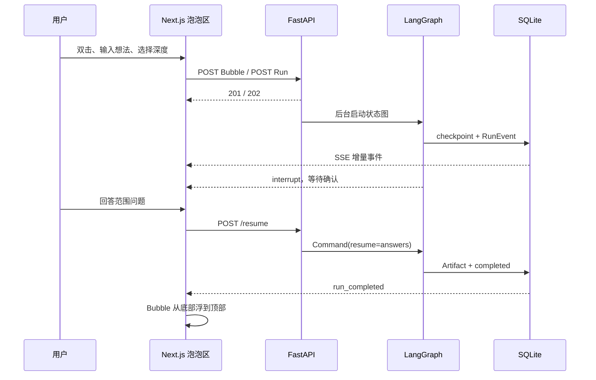

# Bubble Agent 面试学习与问答手册

> 适用岗位：Agent 应用开发、Python 后端、全栈开发、桌面应用开发实习。
>
> 使用方式：先掌握一条端到端主线，再分别深入前端、后端、Agent。不要把三部分背成互不相关的技术名词。

## 0. 先记住一条主线

用户在 Next.js 泡泡区双击，输入项目想法并选择开发深度。前端创建 Bubble 并请求启动 Run；FastAPI 返回 `202 Accepted`，把长任务交给后台线程；LangGraph 根据深度策略执行澄清、发散、收敛、MVP、技术栈和 Critic 节点；需要确认时通过 `interrupt` 暂停并持久化 checkpoint；执行事件落到 SQLite 后由 SSE 推送给前端；产物完成后 Bubble 状态变为 `ready`，Motion 根据状态把它从底部工作带浮到顶部完成带。

这条链路同时说明了三个核心能力：

- 前端不是表单壳，而是把业务状态翻译为空间、尺寸和运动。
- 后端不是简单 CRUD，而是可靠地承接长任务、持久化事件和断点恢复。
- Agent 不是一次 Prompt，而是带条件路由、人工确认、结构化产物和评测的状态图。



## 1. 面试开场

### 1.1 30 秒版本

我做了一个本地优先的桌面 Agent 工作台。用户双击画布输入一个模糊想法，选择轻量、标准或深入模式，系统会用 LangGraph 生成 PRD、MVP 和技术方案。项目不是一次性调用模型，而是有人工确认、SQLite checkpoint、Critic 修订、SSE 运行轨迹和离线评测。前端用 Next.js 静态导出后嵌入 Tauri，Bubble 的大小表示开发深度，纵向位置表示任务状态。

### 1.2 60 秒版本

这个项目解决的是“想法到可开发方案之间缺少结构”的问题。交互上，我没有做传统项目列表加表单，而是做了空间化泡泡区：双击任意空白位置调出聊天栏，深度决定 Bubble 尺寸，未完成任务停在底部，完成后自动浮到顶部。技术上，Next.js 负责静态 UI 和客户端交互，Tauri 管理桌面窗口与 Python sidecar，FastAPI 提供 Bubble、Run、Artifact API，LangGraph 编排可中断和恢复的工作流。所有业务状态、事件与 checkpoint 都落到本地 SQLite，SSE 只负责传输，因此断线后可以按事件 ID 补发。这样既能展示前端交互，也能展示 Python 后端和 Agent 工程化。

### 1.3 三分钟版本的顺序

1. 先演示双击创建、三种尺寸和完成上浮。
2. 解释 Next.js 如何把状态映射成位置与 Motion 动画。
3. 沿着 `POST Run -> 202 -> 后台执行 -> RunEvent -> SSE` 进入后端。
4. 展开 LangGraph 的条件路由、`interrupt`、checkpoint 和 Critic 有界循环。
5. 用自动化测试、20 个离线样本和 Windows 安装包收尾。

## 第一部分：前端把 Agent 状态变成可理解的空间

前端接住的是用户意图，输出的是清晰的 Bubble、操作指令和实时运行反馈。它必须先把“正在推理”变成用户看得懂的状态，后端和 Agent 的可靠性才有展示入口。

### 2.1 为什么从 Vite 迁移到 Next.js

迁移不是因为 Vite 不能完成项目，而是为了展示更完整的 React 工程能力：

- App Router 让布局、页面和客户端叶组件边界更明确。
- `output: "export"` 生成纯静态 `dist`，可被 Tauri 直接托管。
- `next/font` 在构建时打包 Geist 字体，避免运行时依赖外网。
- Next.js 生态更贴近常见实习岗位，同时保留 Tauri 小体积桌面壳。

这里的关键取舍是：页面本身是服务端组件，真正依赖浏览器 API、Tauri IPC、SSE 和 Motion 的 `BubbleWorkspace` 才声明 `"use client"`。这比把整棵组件树都设成客户端组件更清楚。

代码入口：

- `apps/desktop/app/layout.tsx`
- `apps/desktop/app/page.tsx`
- `apps/desktop/src/components/BubbleWorkspace.tsx`
- `apps/desktop/next.config.ts`

### 2.2 交互模型如何体现产品思考

页面只保留两个稳定区域：

- 左侧是空间、文件、功能列表，承担导航和明确操作。
- 右侧是泡泡区，承担想法捕获和状态可视化。

双击空白位置后，聊天栏以点击点为锚出现；用户只需输入想法，不需要先想项目名，前端从首句提取不超过 28 个字符作为名称。选择开发深度后，Bubble 尺寸映射如下：

| 深度 | 直径 | 用户感知 | Agent 策略 |
|---|---:|---|---|
| Spark | 116 px | 小、轻、快 | 最多 2 问，无 Critic |
| Builder | 158 px | 默认个人项目 | 最多 5 问，1 轮 Critic |
| Architect | 202 px | 完整系统设计 | 最多 8 问，2 轮 Critic |

尺寸不是装饰，而是把后端的 token budget、产物数量和评审轮数提前暴露给用户。

### 2.3 为什么任务状态要映射为纵向位置

传统后台会用状态标签表示 `running` 和 `ready`。Bubble Agent 再多走一步：

- `draft/running/waiting/failed/cancelled` 进入底部工作带。
- `ready` 进入顶部完成带。
- 状态变化后只更新目标坐标，Motion 用弹簧动画完成上浮。

因此动画的触发源是后端状态，不是定时器。它回答了一个常见面试问题：动效如何服务业务语义。

横向出生点保存在 `localStorage`，后端无需为纯展示偏好扩充业务表；纵向位置始终由服务器状态计算，避免本地位置和真实任务状态冲突。

### 2.4 如何处理画布布局

组件使用 `ResizeObserver` 获取画布尺寸，再根据每组 Bubble 数量计算列数、单元格宽度和行号。算法需要满足：

- 不让 Bubble 超出画布边界。
- 三种直径使用同一布局函数。
- 上下两个状态带互不混淆。
- 窗口缩放后重新计算目标坐标。
- 大量 Bubble 时按行折叠，而不是无限挤压直径。

`bubblePlacement` 是一个纯函数，所以后续可以单独补布局单元测试，也可以替换为碰撞检测或力导向算法。

### 2.5 状态管理为什么没有直接引入 Redux

当前状态可以分成三类：

- 服务端状态：Bubble、Run、Artifact、RunEvent。
- 视图状态：选中项、抽屉、当前文件、聊天栏位置。
- 本地偏好：Bubble 横向出生点。

单页面 MVP 用 React state、`useMemo` 和 `useCallback` 足够，先不增加全局状态库。若后续出现多页面缓存、乐观更新和复杂失效规则，会优先引入 TanStack Query 管理服务端状态，而不是把所有数据都塞进 Redux。

### 2.6 SSE 在前端如何工作

Run 启动后，前端先读取历史事件，再以最后一个事件 ID 订阅 SSE。事件进入界面后：

- `node_started/node_completed` 更新轨迹。
- `human_input_required` 打开确认界面。
- 终态事件触发 Bubble 和详情重新拉取。
- EventSource 断开时回退到一次延迟 GET。
- 画布对所有未完成 Bubble 做低频轮询，确保非当前选中项也能上浮。

SSE 传输实时变化，GET 获取权威快照。这样即使丢了单个前端事件，也不会永久错误。

### 2.7 桌面端的 Next.js 边界

Tauri 生产环境加载 `dist`，开发环境连接 `127.0.0.1:1420`。浏览器模式下 API 地址来自 `NEXT_PUBLIC_API_BASE`；Tauri 模式下优先调用 Rust `runtime_config`，获取随机本地 token 和 sidecar 地址。

Next.js 静态 HTML 含 hydration 内联脚本，因此 Tauri 生产 CSP 允许 `script-src 'unsafe-inline'`；只有开发 CSP 额外允许 `'unsafe-eval'` 和本地 WebSocket。面试时要主动说明：这是框架运行约束，不等于取消全部 CSP，`connect-src` 仍限制在自身、IPC 和本地 FastAPI。

### 2.8 视觉与可访问性

- 使用 Phosphor 图标，不用字符假装图标。
- 深浅主题都通过语义 CSS 变量实现。
- 错误、等待、运行、完成使用语义色，但品牌只使用一套酸性绿。
- 图标按钮有 `aria-label` 和 `title`。
- 双击创建有左侧按钮作为键盘和触屏替代入口。
- `Escape` 关闭聊天栏或抽屉。
- `prefers-reduced-motion` 下关闭弹簧和循环动画。
- 720 px 以下切换为顶部简化导航，详情抽屉占满可用宽度。

### 2.9 前端高频问答

#### Q1：为什么不用 React Flow？

当前 Bubble 不是节点连线编辑器，核心是状态分区和自然浮动。React Flow 会带来端口、缩放、边等不需要的抽象。先用绝对定位加纯布局函数更轻；出现 Bubble 依赖图时再引入 React Flow。

#### Q2：为什么横向位置用 localStorage，状态不用？

横向位置是设备级展示偏好，丢失不影响业务；运行状态是事实，必须以 FastAPI 和 SQLite 为准。两者生命周期不同。

#### Q3：为什么既有 SSE 又有轮询？

SSE 聚焦当前 Run 的细粒度事件；低频轮询同步整个画布的粗粒度 Bubble 状态。它们负责不同范围，不是重复实现。

#### Q4：Next.js 静态导出有什么限制？

不能依赖运行时服务端路由、Server Actions 或动态 SSR。这个项目的服务端能力在 FastAPI，Next 只承担静态壳和客户端交互，因此限制可接受。

#### Q5：如何优化大量 Bubble 的性能？

先对布局计算做 memoization，再对不可见行做虚拟化或分区渲染；动画层减少阴影和滤镜；服务端状态改成增量推送；数量继续增长时引入 Canvas/WebGL。MVP 不提前承担这些复杂度。

#### Q6：如何测试双击和上浮？

组件测试验证双击空白区打开聊天栏、交互区域不误触；纯函数测试验证三种尺寸和上下边界；端到端测试 mock API，先返回 `running` 再返回 `ready`，断言目标带与状态文本变化，不测试每一帧像素。

### 从前端过渡到后端

当面试官问“Bubble 为什么真的会从底部浮到顶部”时，不要只讲 Motion。完整答案是：Agent 完成后更新业务库，SSE 发出终态，前端重新拉取 Bubble，`status` 从 `running` 变成 `ready`，布局函数切换目标带，Motion 才执行上浮。接下来进入后端。

## 第二部分：后端把长时间 Agent 运行变成可靠服务

后端接住前端的 Bubble 和 Run 请求，输出稳定 API、可恢复执行、事件流和持久化产物。它是 UI 状态与 Agent 推理之间的可靠性边界。

### 3.1 API 为什么把 Bubble 和 Run 分开

Bubble 是长期项目容器，Run 是某次执行记录。一个 Bubble 可以多次运行并产生多个 Artifact 版本。拆分后可以：

- 重跑而不复制项目。
- 保留每次模型、Prompt 版本、状态和错误。
- 让 Artifact 版本与 Run 生命周期解耦。
- 后续做运行对比和回滚。

核心实体关系是：`Bubble 1 -> N AgentRun 1 -> N RunEvent`，`Bubble 1 -> N Artifact`。

### 3.2 为什么启动 Run 返回 202

Agent 运行可能持续几十秒，还可能中途等待用户。API 不应占住请求直到完成。`POST /api/bubbles/{id}/runs` 创建记录后返回 `202 Accepted`，Orchestrator 在线程池运行同步 LangGraph。

这不是完整分布式任务系统。MVP 不引入 Celery 和 Redis，是因为本地单用户只有一个 sidecar；线程池、数据库状态和重启恢复已经覆盖主要风险。若变成多用户云服务，再迁移到独立 worker 和消息队列。

### 3.3 FastAPI 的并发边界

LangGraph 和 SQLite 调用主要是同步代码，不能直接阻塞 ASGI 事件循环。项目将图执行放入 `ThreadPoolExecutor`，SSE 的数据库读取用 `asyncio.to_thread`。

需要说明的隐患：

- SQLite 写锁导致高并发受限。
- 线程无法安全强杀正在进行的模型调用。
- 进程退出会终止线程，所以必须依赖 checkpoint 和状态恢复。
- 线程池大小必须受控，否则本地资源耗尽。

### 3.4 SSE 为什么比 WebSocket 合适

运行轨迹主要是服务端到客户端的单向流。SSE 基于 HTTP，EventSource 自带重连语义，协议和调试成本都更低。

可靠性不依赖内存 pub/sub：每个事件先写入 `run_events`，SSE 按 `after_id` 查询；客户端也可用 `/events/history` 补发。即使前端晚打开、窗口刷新或连接中断，事件仍能重放。

### 3.5 为什么有两个 SQLite

- 业务库保存 Bubble、Run、RunEvent、Artifact。
- LangGraph checkpoint 库保存线程执行状态和中断恢复点。

两者职责不同。业务库面向产品查询和版本管理；checkpoint 是工作流引擎内部状态。分开可避免业务迁移误伤图恢复，也避免把 LangGraph 内部结构泄漏给 API。

它们仍不是严格的跨库事务。当前通过状态修复和幂等写入降低风险；更高一致性场景可以用 outbox、单事务存储或基于任务队列的提交协议。

### 3.6 Artifact 如何保证可演进

模型先返回 Pydantic 结构，再由 renderer 生成 Markdown，同时保存：

- `schema_data`：机器可读，方便校验、差异比较和未来生成代码。
- `markdown`：人类可读，方便预览和导出。
- `version`：同一 Bubble、同一类型递增。

只存 Markdown 会让后续自动化重新解析自然语言；只存 JSON 又会降低用户可读性。双存储是有意的读写模型折中。

### 3.7 本地 sidecar 和安全边界

Tauri 启动打包后的 Python sidecar，后端只监听 `127.0.0.1`。Rust 启动时生成随机 token，通过命令传给 Next 客户端；普通 API 使用 `X-Bubble-Token`，EventSource 因浏览器 API 不能自定义 header，使用受限查询参数。

安全措施包括：

- 不监听公网网卡。
- CSP 限制可连接地址。
- API key 只从环境变量读取，不落业务库。
- sidecar stdout/stderr 持续排空，避免管道缓冲区写满导致死锁。
- 窗口退出时回收子进程。

查询参数 token 可能进入本地日志，所以生产日志不能输出完整 URL；如果未来暴露网络，应改为短期票据或同源代理。

### 3.8 后端测试分层

- Policy 单测：深度策略、预算、产物种类和 Critic 轮数。
- API 工作流测试：创建、运行、确认、完成、导出。
- 安全与事件测试：token、事件历史、SSE 终态。
- 重启恢复测试：把进行中状态修复为可恢复状态。
- Ruff 和 mypy：静态质量门槛。

### 3.9 后端高频问答

#### Q7：为什么不用 Celery？

当前是本地单用户、单进程 sidecar，Celery 需要 broker 和 worker，会显著增加安装与运维成本。线程池加 checkpoint 已满足 MVP；任务并发和跨机器调度成为真实需求后再迁移。

#### Q8：为什么不用 Redis 做事件流？

SQLite 事件表同时承担审计、补发和本地持久化。Redis Stream 更适合多实例和高吞吐，但会破坏零依赖本地安装目标。

#### Q9：SSE 断线如何续传？

服务端为每个事件分配递增 ID；客户端带 `after_id`，也可使用 `Last-Event-ID`；服务端查询大于游标的记录再继续等待新事件。

#### Q10：如何防止重复恢复产生重复 Artifact？

恢复使用同一 `thread_id`，图从 checkpoint 继续；持久化节点基于 Bubble、Artifact 类型和版本规则写入。进一步加强可给 Run 增加幂等键，并在数据库建立唯一约束。

#### Q11：SQLite 写并发不够怎么办？

单用户桌面场景先启用 WAL、缩短事务并限制并发；云端化后将业务库迁到 PostgreSQL，将 checkpoint 迁到对应持久化实现，Repository 和图状态接口保持不变。

#### Q12：为什么 Repository 模式有价值？

API 和 Graph 不直接依赖 SQLAlchemy Session，而依赖明确的数据操作。这样测试可以替换数据目录，迁移数据库时调用方变化更小，也把事务和版本规则集中在一处。

### 从后端过渡到 Agent

后端解决“任务如何可靠运行”，但不决定“任务应该怎么思考”。Run 的 `thread_id`、checkpoint 路径、恢复指令和事件回调都交给 LangGraph，接下来进入 Agent 状态图。

## 第三部分：Agent 把模糊想法变成有约束的工程产物

Agent 接住的是原始想法、开发深度和人工答案，输出的是结构化计划、Markdown 产物、评审结果和可观测事件。

### 4.1 为什么使用 LangGraph

普通 Chain 适合固定的一次性流水线，本项目存在：

- 开发深度条件路由。
- 信息不足时人工确认。
- 暂停后跨请求恢复。
- Critic 通过或定向修订的循环。
- 每个节点独立观测和失败定位。

这些需求天然对应带状态和 checkpoint 的图。纯 `if/else` 也能写，但中断恢复、可视化、节点事件和演进成本会更高。

### 4.2 状态图节点

```text
START
  -> normalize_idea
  -> route_by_depth
  -> find_information_gaps
  -> await_user_confirmation
  -> diverge_directions      # Spark 可跳过
  -> score_and_converge      # Spark 可跳过
  -> define_mvp
  -> recommend_stack
  -> draft_artifacts
  -> critic_review           # Builder / Architect
  -> revise_artifacts        # 有界循环
  -> persist_and_render
  -> END
```

每个节点只做一类决策，并通过 `updated_fields` 说明写了哪些状态。节点越单一，越容易做重试、评测和故障定位。

### 4.3 深度策略如何真正生效

深度不是 Prompt 里一句“请更详细”，而是显式策略：

| 策略 | Spark | Builder | Architect |
|---|---:|---:|---:|
| 最大澄清问题 | 2 | 5 | 8 |
| 发散方向 | 否 | 是 | 是 |
| Critic 轮数 | 0 | 1 | 2 |
| Token 预算 | 4,000 | 10,000 | 18,000 |
| 产物 | PRD、MVP | 加技术方案 | 加架构草案 |

这张表同时驱动图路由、模型预算、产物集合和前端 Bubble 尺寸，使产品语义贯穿三层。

### 4.4 `interrupt` 如何实现 Human-in-the-loop

信息缺口节点产出已知事实、假设和问题。确认节点调用 `interrupt(payload)` 后，LangGraph 把当前状态写入 SQLite checkpoint，并通过内部控制流返回中断信息。

用户回答后，后端使用同一 `thread_id` 调用 `Command(resume=answers)`。图不会从头重新生成，而是从中断点恢复。这就是 checkpoint 和普通聊天历史的区别：聊天历史记录说过什么，checkpoint 记录执行到哪里以及当前完整状态。

`GraphInterrupt` 不能当普通异常捕获，否则会把正常暂停错误地标为失败。Orchestrator 必须单独识别中断结果并把 Run 状态设为 `waiting`。

### 4.5 发散、收敛和 Critic

Builder 和 Architect 先生成 2 到 3 个方向，再按价值、成本和风险评分，选择一个方向进入 MVP。这样比直接输出第一个答案更能抵抗模型的首选偏差。

Critic 检查：

- PRD 与 MVP 是否矛盾。
- 技术栈是否超出项目规模。
- 验收标准是否可测试。
- 是否遗漏关键风险。

Critic 不是另一个永不停止的 Agent。`critic_rounds` 来自深度策略，修订次数达到上限后必须持久化，因此循环有明确终止条件。

### 4.6 模型抽象与结构化输出

业务节点依赖统一 Model Gateway，而不是直接调用某个 SDK。当前有：

- Demo Provider：确定性离线输出，支持无 Key 演示和回归测试。
- OpenAI-compatible Provider：通过配置连接真实模型。

每个模型调用指定 Pydantic 目标类型。适配器负责 JSON 解析、Schema 校验、有限重试和错误转换。结构化输出不是绝对可靠，所以要区分：

- 传输错误和限流：指数退避重试。
- JSON 解析或 Schema 错误：带校验信息做有限修复。
- 安全拒绝、配置错误：直接失败并向 Run 写错误。
- 业务评审不通过：进入 Critic 修订，不属于传输重试。

### 4.7 Prompt Injection 的边界

用户输入是数据，不是系统指令。防护思路：

- 系统 Prompt 明确任务和输出 Schema。
- 不把用户文本拼接为工具权限。
- MVP 没有文件写入、Shell 或网络工具调用。
- 结构化输出经过 Pydantic 校验。
- 模型供应商凭据不进入 Prompt 和数据库。
- 将来增加工具时采用 allowlist、参数校验和人工批准。

### 4.8 Agent 评测怎么讲

普通测试验证确定性代码，Agent 评测验证输出质量和策略遵循。项目的 20 个离线样本检查：

- 三种深度是否产生正确产物集合。
- Spark 是否跳过发散和 Critic。
- Builder/Architect 是否按策略执行评审。
- 必填结构字段是否存在。
- MVP 是否有范围外项和成功指标。

“20 个样本 100%”只代表离线确定性 Provider 通过当前契约，不代表真实模型质量 100%。真实模型还需要人工 rubric、重复采样、成本与延迟统计，以及按模型和 Prompt 版本分层比较。

### 4.9 Agent 高频问答

#### Q13：Critic 算 Multi-Agent 吗？

当前更准确的说法是多角色工作流：主生成角色和 Critic 角色共享同一图状态和模型网关。它体现角色分工，但不是多个自治 Agent 协商系统。

#### Q14：为什么不让模型自己决定是否结束 Critic？

模型可以判断质量是否通过，但系统必须掌握最大轮数。把终止权完全交给模型会带来无限循环、成本失控和不可预测延迟。

#### Q15：State 里应该放什么？

只放跨节点需要、可序列化且值得恢复的数据，例如规范化想法、深度策略、人工答案、候选方向、MVP、技术栈、评审结果和轮次。客户端对象、数据库连接和大段日志不放入 State。

#### Q16：checkpoint 和业务库为什么不能只留一个？

checkpoint 面向图引擎恢复，结构可能随 LangGraph 变化；业务库面向产品查询、版本和导出。强行合并会让两个生命周期耦合。

#### Q17：如果真实模型输出仍然不稳定怎么办？

先缩小单节点职责和 Schema，再补 few-shot 与字段级校验；对失败类型分类重试；对关键质量建立离线数据集和人工抽检，而不是只继续堆 Prompt。

#### Q18：如何更换模型供应商？

新增 Model Gateway 实现，统一返回 Pydantic 模型；配置层选择 provider、base URL 和模型名；图节点不改。随后跑相同评测集比较质量、延迟和成本。

## 5. 三层串联的故障故事

### 故事一：前端构建成功但桌面端可能无法交互

- 现象：Next 静态导出有 HTML 和脚本，但 Tauri 原 CSP 只允许外部 `self` 脚本。
- 定位：检查 `dist/index.html`，发现 Next hydration 使用内联脚本。
- 修复：生产 CSP 只增加 `script-src 'unsafe-inline'`，开发 CSP 再增加本地 WebSocket 和 `'unsafe-eval'`。
- 收获：Web 构建通过不等于 WebView 运行通过，桌面壳的安全策略也是前端运行时的一部分。

### 故事二：正常暂停被当成失败

- 现象：用户需要确认时 Run 进入 failed。
- 原因：把 LangGraph 的中断控制流当普通异常处理。
- 修复：识别 interrupt payload，Run 设为 waiting；恢复时复用 thread ID。
- 收获：Agent 框架的控制流异常和业务失败必须分开。

### 故事三：实时连接断开后界面丢进度

- 现象：只使用内存事件时，窗口刷新后历史轨迹消失。
- 修复：先把 RunEvent 落库，再用 SSE 按事件 ID增量发送；终态后重新 GET 权威快照。
- 收获：实时通道不应是事实来源，持久化事件才是。

### 故事四：源码能运行，sidecar 安装包不能运行

- 现象：开发环境 Python 正常，PyInstaller 后模块或资源缺失。
- 修复：显式收集 LangGraph、SQLAlchemy 等动态依赖，使用 target triple 命名 sidecar，并在隔离目录做 smoke test。
- 收获：交付链路本身需要测试，不能把“本机能跑”当完成。

## 6. 简历写法

### 项目标题

**Bubble Agent｜Next.js + Tauri + FastAPI + LangGraph 本地项目规划 Agent**

### 三条项目描述

- 设计空间化 Bubble 工作台，将开发深度映射为 116/158/202 px 三档尺寸，将 `running/ready` 状态映射为底部工作带与完成上浮动画，使用 Next.js 静态导出、Motion、响应式布局和可访问交互嵌入 Tauri。
- 基于 FastAPI、SQLAlchemy 与 SQLite 实现 Bubble/Run/Artifact 生命周期，采用 `202 + 线程池 + 持久化 RunEvent + SSE 游标补发` 承载长任务，并通过本地 token、CSP 和 sidecar 回收控制桌面安全边界。
- 使用 LangGraph 构建 12 节点深度感知工作流，实现 `interrupt + SQLite checkpoint` 人工确认、发散收敛、Critic 有界修订、Pydantic 结构化产物与 20 样本离线评测。

不要写“精通 Next.js、精通 LangGraph”。用具体机制、数据和取舍证明能力。

## 7. 能力矩阵

| 能力 | 项目证据 | 可投岗位 |
|---|---|---|
| React/Next.js 工程 | App Router、客户端边界、静态导出、类型检查 | 前端、全栈 |
| 交互与视觉 | 双击聊天栏、状态空间映射、Motion、主题、响应式 | 前端、客户端 |
| Python API | FastAPI、Pydantic、Repository、错误边界 | Python 后端 |
| 长任务与实时系统 | 202、线程池、SSE、事件补发、恢复 | 后端、AI 应用 |
| Agent 编排 | LangGraph、条件路由、interrupt、Critic | Agent 开发 |
| 数据与一致性 | 两个 SQLite、版本化、幂等思路 | 后端 |
| 桌面交付 | Tauri、Rust sidecar、CSP、NSIS | 客户端、全栈 |
| 质量工程 | pytest、Ruff、mypy、CI、离线评测 | 所有开发岗 |

## 8. 不要说错

- 不要说 Next.js 在 Tauri 内提供后端，真正后端是 FastAPI sidecar。
- 不要说 SSE 保证事件不丢，事件落库和游标补发才提供可恢复性。
- 不要说 checkpoint 等于聊天记忆。
- 不要说 Critic 是完全自治的 Multi-Agent。
- 不要说离线评测 100% 代表真实模型质量 100%。
- 不要说 SQLite 支持无限并发，它是本地单用户场景的取舍。
- 不要说 CSP 完全安全，必须说明 Next 内联脚本带来的最小放宽。
- 不要说当前 Bubble 有物理碰撞引擎，当前是确定性分带布局。

## 9. 面试前代码走读路线

1. `apps/desktop/src/components/BubbleWorkspace.tsx`：从双击创建读到状态上浮。
2. `apps/desktop/src/api.ts`：浏览器与 Tauri 的运行时配置、SSE。
3. `apps/desktop/next.config.ts`：静态导出和 Tauri 兼容。
4. `backend/bubble_agent/api/bubbles.py`：Bubble 与 Artifact API。
5. `backend/bubble_agent/api/runs.py`：Run、resume、SSE。
6. `backend/bubble_agent/services/orchestrator.py`：线程、状态和恢复边界。
7. `backend/bubble_agent/agents/policies.py`：深度策略。
8. `backend/bubble_agent/agents/graph.py`：条件路由、interrupt、Critic。
9. `backend/bubble_agent/persistence/repositories.py`：版本、事件和状态。
10. `apps/desktop/src-tauri/src/main.rs`：sidecar 生命周期和 token。
11. `backend/tests` 与 `backend/evals`：确定性测试和质量评测的区别。

## 10. 最后自测

在不看文档的情况下，应该能回答：

1. 从双击到 Bubble 上浮经过哪些状态和 API？
2. 为什么 Bubble 尺寸不是纯 UI 决策？
3. 为什么 Next.js 适合静态导出进 Tauri？
4. 为什么 production CSP 仍需允许 Next 内联脚本？
5. 为什么 Run 返回 202？
6. 为什么 SSE 之外还要持久化 RunEvent？
7. 两个 SQLite 分别保存什么？
8. `interrupt` 和普通异常有什么区别？
9. Critic 为什么一定会停？
10. Demo Provider 和真实模型评测分别证明什么？
11. 当前最大技术债是什么？
12. 如果云端化，哪些模块先替换？

建议第 11 题回答：当前最大技术债是前端仍以组件内状态和轮询同步整个画布，缺少自动化浏览器测试与大规模 Bubble 碰撞布局；后端仍是单进程线程池和双 SQLite 的最终一致性。它们都是与本地单用户 MVP 边界一致、可以明确演进的债务。
