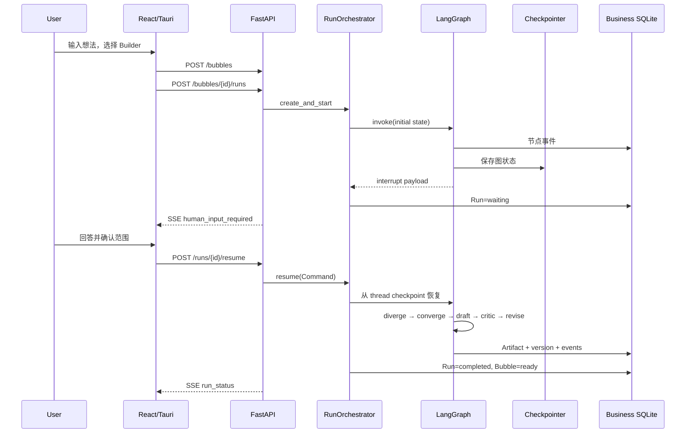

# Bubble Agent 项目拆解与开发复盘

> 版本：v1.0 · 面向个人作品集、Agent / Python 后端实习面试

## 1. 项目要解决什么

用户通常不是没有想法，而是不知道如何把一句模糊想法变成边界明确、能开工、能验证的方案。通用聊天模型的问题是：内容一次性、范围容易膨胀、缺少中途确认、无法解释执行路径，关闭会话后也很难恢复。

Bubble Agent 将这个问题建模为一个有状态过程：

1. 提取已知事实与假设；
2. 依据开发深度设定问题和计算预算；
3. 只追问影响方向的关键信息；
4. 在生成前暂停，等待用户确认；
5. 对较深模式做方向发散和评分收敛；
6. 生成结构化项目计划；
7. 用 Critic 检查并定向修订；
8. 保存结构化产物、Markdown、版本和执行轨迹。

## 2. MVP 边界

### 已完成

- Bubble 创建、列表、打开、更新、删除；
- Spark、Builder、Architect 三种执行策略；
- LangGraph 人工确认中断与恢复；
- Builder/Architect 的发散、收敛与 Critic 循环；
- PRD、MVP、技术方案、架构草案的结构化生成和 Markdown 渲染；
- Run 和节点事件持久化、SSE 增量事件流；
- SQLite 业务数据和 LangGraph checkpoint 分离；
- Demo / OpenAI-compatible 模型适配器；
- React 桌面工作台和执行轨迹；
- Tauri 启停 PyInstaller sidecar、随机本地令牌、NSIS 安装包；
- 三档端到端测试、重启恢复测试、20 样本离线评测。

### 明确不做

- 自动写代码、执行 Shell 或部署项目；
- 多个自治 Agent 并行协作；
- 云同步、账号、团队权限和计费；
- 大规模 RAG 或向量数据库；
- 跨平台安装包与自动更新；
- 产物的可视化版本 Diff。

把“不做什么”写清楚，是这个项目产品能力的重要组成部分，也能避免面试时被带入尚未实现的功能。

## 3. 系统分层

| 层 | 主要职责 | 关键文件 |
| --- | --- | --- |
| React UI | Bubble 工作台、深度选择、确认表单、产物与轨迹展示 | `apps/desktop/src/App.tsx`、`api.ts` |
| Tauri Host | 启动令牌、sidecar 生命周期、应用数据目录 | `apps/desktop/src-tauri/src/main.rs` |
| FastAPI API | CRUD、运行控制、SSE、依赖注入和错误映射 | `backend/bubble_agent/api/`、`main.py` |
| Orchestration | 线程池运行、状态迁移、取消、错误边界 | `services/orchestrator.py` |
| Agent Graph | 节点、条件边、interrupt、Critic 循环 | `agents/graph.py`、`policies.py` |
| Model Adapter | 供应商隔离、JSON 输出、Pydantic 校验和重试 | `models/` |
| Persistence | SQLAlchemy 实体、Repository、事务与版本 | `persistence/` |
| Artifact View | 从结构化计划确定性渲染 Markdown | `artifacts/renderers.py` |
| Quality | API/图/恢复测试与 20 样本评测 | `backend/tests/`、`backend/evals/` |

依赖方向坚持从外向内：UI 调 API；API 调 orchestrator/repository；graph 依赖模型协议和 repository，不依赖具体 UI 或供应商 SDK。

## 4. 一次 Builder 运行的数据流



## 5. 深度策略如何真正生效

`DepthPolicy` 是不可变策略对象，随状态进入图：

| 策略项 | Spark | Builder | Architect |
| --- | ---: | ---: | ---: |
| 最大澄清问题 | 2 | 5 | 8 |
| 发散/收敛 | 否 | 是 | 是 |
| 修订轮次预算 | 0 | 1 | 2 |
| 产物数 | 2 | 3 | 4 |
| Token 预算 | 4k | 10k | 18k |

条件边根据策略决定是否经过 `diverge_directions`；Critic 路由根据 `revision_count` 和评审结果决定继续、修订或结束；最终持久化只保存策略允许的 Artifact 类型。因此，深度差异能从事件轨迹、产物集合和自动化测试中客观观察。

## 6. 状态和持久化

### 图状态

`ProjectGraphState` 使用可序列化字段保存：标识、输入、深度策略、澄清结果、候选方向、用户回答、项目计划、评审问题、修订次数和错误。

不把 Markdown 当作唯一真相。模型先生成 Pydantic 对象，系统保存 JSON，再由 Renderer 生成 Markdown。收益是：

- API 和测试可按字段断言；
- 将来可以增加 HTML、PDF 或代码 Agent 输入格式；
- Critic 能针对具体路径修订；
- 版本 Diff 可以在 JSON 层实现。

### 两个 SQLite 的边界

- 业务库：Bubble、Decision、Artifact、AgentRun、RunEvent；
- checkpoint 库：LangGraph 每个 `thread_id` 的执行状态。

业务代码不解析 checkpoint 内部表。checkpoint 负责“图从哪里继续”，业务库负责“用户能看到什么、审计什么”。这能避免框架升级污染业务 Schema。

### 幂等和版本

- 每次执行有独立 `run_id` 和 `thread_id`；
- RunEvent 使用数据库自增 ID，可作为 SSE 游标；
- Artifact 以 Bubble、类型和版本组织，每次完成生成新版本；
- 只有 `persist_and_render` 节点写最终产物，减少半成品暴露。

## 7. 模型层

模型层暴露 `StructuredModel.generate(schema, task, context)` 协议。图节点只声明目标 Schema 和上下文，不知道 HTTP 格式或模型厂商。

### Demo Provider

确定性 Demo Provider 的用途：

- 不联网也能演示完整产品；
- 自动化测试无需消耗 Token；
- 固定输出使图路由回归可重复；
- 面试现场不受 API 限流或网络影响。

它不是实际模型效果的替代品，README 与评测报告明确区分“工程契约评测”和“语义质量评测”。

### OpenAI-compatible Provider

- 通过 Chat Completions 接口接入兼容服务；
- 将 Pydantic JSON Schema 放入提示约束；
- 对返回 JSON 做解析和 Schema 校验；
- 将网络、认证、解析错误统一为模型网关错误；
- 只对可恢复失败做有限重试。

密钥来自环境变量或一次性连通测试请求，不进入业务数据库和日志。

## 8. API 与 SSE

CRUD 走普通 HTTP JSON。Agent 事件是服务端单向流，因此选 SSE：

- 浏览器原生 `EventSource`；
- 自动重连模型简单；
- `Last-Event-ID` / `after_id` 可以续传；
- 服务端事件已经持久化，重连不依赖进程内缓存。

事件流终止条件包括 waiting、completed、failed、cancelled。前端收到终态后重新读取 Bubble 详情，以数据库快照作为最终事实，避免把 SSE 当成数据存储。

## 9. 桌面进程模型与安全

Tauri 启动时：

1. 生成 UUID 访问令牌；
2. 解析应用数据目录；
3. 为 sidecar 注入 host、port、token、data directory；
4. 启动 PyInstaller 可执行文件并持续排空 stdout/stderr；
5. 通过 command 将 API base 和 token 提供给前端；
6. 窗口销毁时 kill child，避免孤儿进程。

后端只绑定 `127.0.0.1`。所有 `/api` 路由需要令牌；SSE 因 `EventSource` 不能设置自定义 Header，使用 URL query token。生产环境还应增加动态端口、令牌日志过滤、Windows 代码签名和安装包完整性校验。

## 10. 可靠性设计

| 风险 | 当前处理 |
| --- | --- |
| 模型 JSON 不合法 | Pydantic 校验 + 有限重试 |
| 人工确认前误生成 | LangGraph interrupt 是硬边界 |
| 应用在 waiting 时退出 | checkpoint + 业务 Run 状态可恢复 |
| SSE 断线 | DB 事件 ID + `after_id` 续传 |
| 节点异常 | `node_failed` 与 `run_failed` 分层记录 |
| LangGraph 正常中断被误报 | 显式重抛 `GraphInterrupt`，有回归断言 |
| 重复运行覆盖产物 | Artifact 版本递增 |
| sidecar 阻塞 | 异步排空子进程事件通道 |
| 本机其他进程访问 API | 回环绑定 + 每次启动随机令牌 |

一个真实修复案例：最初节点包装器把 LangGraph 的 `GraphInterrupt` 当作普通异常记录为 `node_failed`，虽然运行仍能等待用户，但轨迹会出现巨大错误堆栈。修复方式是先识别并重抛框架控制流异常，再只记录真正失败；测试增加“waiting 阶段不得出现 node_failed”的断言。

另一个打包案例：Uvicorn 开发态使用字符串模块路径，在 PyInstaller 单文件环境中无法重新导入模块。改为直接传 `app` 对象后，打包 sidecar 的健康检查通过。

## 11. 测试和评测拆解

### 自动化测试

- Spark：两问预算、无发散、无 Critic、两个产物；
- Builder：发散/收敛、Critic 与修订、三个产物；
- Architect：深入产物集合；
- Export：导出全部最新 Artifact；
- 404：资源错误语义；
- Restart recovery：关闭第一个 App 实例后，从同一数据库/checkpoint 恢复；
- DepthPolicy：三档参数契约。
- Local auth：缺少或错误令牌返回 401；
- SSE/cancel：query token、终态事件与 Bubble 取消状态一致。

### 20 样本离线评测

每个样本检查七个确定性维度：人工中断、问题预算、正常完成、产物契约、Markdown 非空、无节点失败、深度路径正确。当前 20/20 全项通过。

它没有伪装成内容质量评测。接入真实模型后，应再标注：

- 澄清问题相关性；
- MVP 范围回流率；
- 目标、用户故事、技术栈术语一致性；
- 技术选择理由是否与约束相关；
- 不确定信息是否被错误断言；
- 人工 1–5 分与 judge 模型的一致性。

## 12. 构建与交付链路

```text
Python source
  └─ PyInstaller one-file sidecar
       └─ target-triple filename
React/TypeScript
  └─ Vite production assets
Rust/Tauri
  └─ release executable
       └─ NSIS current-user installer
```

已验证：sidecar 真实启动、`/health` 返回 ok、无 token 请求返回 401、Cargo check 通过、release executable 与 NSIS 安装包生成成功。

## 13. 里程碑复盘

| 阶段 | 交付 | 主要风险 |
| --- | --- | --- |
| 1. 契约 | Pydantic Schema、DepthPolicy、数据库实体 | 深度沦为 Prompt 参数 |
| 2. 图主链 | interrupt、分支、Critic、持久化 | 控制流异常和循环退出 |
| 3. API | CRUD、运行控制、SSE、鉴权 | 后台线程和终态一致性 |
| 4. UI | 创建、确认、Artifact、Trace | SSE 与快照竞态 |
| 5. 可靠性 | 恢复测试、20 样本评测 | 只测 Happy Path |
| 6. 桌面交付 | sidecar、Tauri、NSIS | 开发态与打包态差异 |
| 7. 面试包装 | README、拆解、学习手册 | 只讲功能不讲取舍 |

仓库同时提供 GitHub Actions：Python job 执行 Ruff、mypy、pytest 和 20 样本评测；Frontend job 执行类型检查与生产构建；Rust job 使用锁文件运行 `cargo check`。

## 14. 完成定义审计

| 条件 | 状态 | 证据 |
| --- | --- | --- |
| Windows 桌面启动，无需手动启动 Python | 完成 | Tauri release + bundled PyInstaller sidecar |
| 三种深度端到端测试 | 完成 | `backend/tests/test_api_workflow.py` |
| 人工确认前不生成最终方案 | 完成 | `interrupt` + waiting 断言 |
| Builder 保存 PRD/MVP/技术方案 | 完成 | API 测试与 UI 演示 |
| 应用重启后恢复 waiting run | 完成 | `test_restart_recovery.py` |
| 节点轨迹与 Markdown 导出 | 完成 | SSE/RunEvent + export API |
| API Key 不进入 DB/日志/导出 | 完成（当前配置边界） | 环境读取；测试接口不保存 |
| README、截图、取舍、运行与限制 | 完成 | 根 README |
| 20 样本与结果报告 | 完成 | `backend/evals/` |

## 15. 下一阶段优先级

1. 动态分配 sidecar 端口，并等待健康检查后显示主界面；
2. 使用 Windows Credential Manager / keyring 实现模型配置页；
3. 增加真实模型语义评测和成本/Token 指标；
4. 增加产物版本列表和 JSON-aware Diff；
5. 将安全点取消升级为可取消 HTTP 请求；
6. GitHub Actions 跑 Python、TypeScript、Rust 和 Windows 打包；
7. 代码签名、自动更新、崩溃恢复提示。
