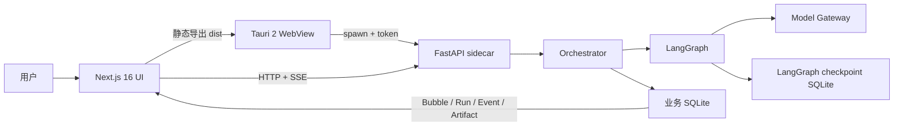

# Bubble Agent 项目拆解与开发复盘

> 本文记录当前可运行版本的真实实现、关键取舍、迁移过程和下一阶段计划。它不是理想架构清单，而是一次面向 Agent / Python 后端实习面试的个人项目复盘。

## 1. 项目定位

Bubble Agent 是一个本地优先的桌面项目规划 Agent。用户不需要先写完整需求，只要在画布中双击并输入一个想法，再选择开发深度，系统会生成 PRD、MVP、技术方案等结构化产物，并把完整项目记忆保存在一个 Bubble 中。

核心价值不是“模型能写 PRD”，而是把不确定的推理过程做成可观察、可暂停、可恢复、可评测的产品工作流。

本版重点展示四类能力：

- Next.js 前端与空间化交互设计。
- FastAPI 长任务、SSE 和持久化后端。
- LangGraph 状态图、Human-in-the-loop 和 Critic。
- Tauri + Python sidecar 的桌面交付链路。

## 2. 最终用户体验

### 2.1 页面结构

左侧是稳定控制区：

- 空间：全部 Bubble 和实时状态。
- 文件：当前 Bubble 的 PRD、MVP、技术方案、架构草案和运行轨迹。
- 功能：重新运行、导出 Markdown、删除。
- 底部：本地 Agent 连接与模型信息。

右侧是泡泡区：

- 双击任意空白位置打开聊天栏。
- 输入想法，系统自动取首句生成项目名。
- 选择 Spark、Builder、Architect 开发深度。
- 新 Bubble 出现在底部工作带。
- 完成后根据 `ready` 状态浮到顶部完成带。
- 点击 Bubble 打开项目抽屉，查看产物、运行轨迹或回答确认问题。

### 2.2 业务语义如何进入视觉

| 视觉变量 | 业务含义 | 数据来源 |
|---|---|---|
| Bubble 直径 | 开发深度 | `Bubble.depth` |
| 纵向位置 | 是否完成 | `Bubble.status` |
| 状态点颜色 | 运行、等待、失败、完成 | Bubble / Run 状态 |
| 上浮动画 | Run 到达终态 | SSE + 权威 GET |
| 文件列表 | Agent 产物集合 | `Artifact[]` |
| 轨迹时间线 | LangGraph 节点事件 | `RunEvent[]` |

这里最重要的产品决策是：动效由业务状态驱动。前端没有用固定倒计时伪造“生成完成”。

## 3. 系统架构



### 3.1 前端层

- Next.js 16 App Router。
- React 19 + TypeScript。
- Motion 负责状态驱动动画。
- Phosphor Icons 负责统一图标语义。
- React Markdown 负责产物预览。
- `output: "export"` 和 `distDir: "dist"` 兼容 Tauri。

### 3.2 桌面层

- Tauri 2 提供窗口、WebView 和 NSIS 打包。
- Rust 启动 Python sidecar、生成本地 token、暴露运行时配置并回收子进程。
- 生产静态资源和 Python 后端一起进入安装包。

### 3.3 后端层

- FastAPI 提供 Bubble、Run、Artifact、事件与健康检查 API。
- Pydantic 作为 API 与模型结构的统一 Schema。
- SQLAlchemy + SQLite 保存业务数据。
- 线程池承载同步 LangGraph 长任务。

### 3.4 Agent 层

- LangGraph 状态图编排 12 个节点。
- SQLite checkpointer 支持暂停和恢复。
- 深度策略控制问题数量、发散、Critic、预算和产物。
- Demo Provider 支持离线演示，OpenAI-compatible Provider 支持真实模型。

## 4. 前端重构拆解

### 4.1 为什么放弃原 Vite 工作台布局

原版是“侧栏项目列表 + 主区文档 + 右侧轨迹”的标准后台结构，功能完整，但没有把 Bubble 的概念变成主要交互，也不容易在面试中体现前端产品判断。

这次重构做了两件事：

1. 工程从 Vite 迁移到 Next.js 静态导出。
2. 信息架构从文档工作台变成空间化 Bubble 画布。

迁移后仍保留原有能力：创建、运行、确认、轨迹、文件预览、导出、重跑和删除。

### 4.2 Next.js 与 Tauri 的兼容方案

`apps/desktop/next.config.ts`：

```ts
const nextConfig = {
  output: "export",
  distDir: "dist",
  images: { unoptimized: true },
};
```

因此生产链路仍是：

```text
next build -> apps/desktop/dist -> Tauri frontendDist -> NSIS
```

没有使用 Next Server、Server Actions 或动态 SSR。后端职责完全留在 FastAPI，避免把桌面应用变成两个服务端运行时。

### 4.3 Server / Client 组件边界

- `app/layout.tsx`：Metadata、字体、全局样式，保持服务端组件。
- `app/page.tsx`：只组合页面入口。
- `BubbleWorkspace.tsx`：声明 `use client`，包含 Web API、Tauri 动态导入、SSE、Motion 和交互状态。

客户端边界集中在一个明确的工作区，而不是从根布局开始全部客户端化。

### 4.4 双击聊天栏

画布的 `onDoubleClick` 计算鼠标相对坐标，并把聊天栏限制在可见区域。通过 `[data-interactive]` 排除 Bubble、抽屉、侧栏和控件，防止双击文本或按钮误触创建。

键盘和触屏用户可使用左侧“捕获新想法”按钮，所以双击不是唯一入口。

聊天栏只要求一个最小输入：项目想法。名称由首句生成，减少表单感。开发深度以三段选择呈现，并同时显示对应目标。

### 4.5 Bubble 布局算法

`ResizeObserver` 持续获取画布宽高。`bubblePlacement` 输入：

- 当前组内索引和数量。
- Bubble 直径。
- `top/bottom` 状态带。
- 画布尺寸。
- 可选出生位置。

输出目标 `x/y`。算法按 224 px 目标单元宽度计算列数，再换行并做边界 clamp。纯函数让布局逻辑独立于组件生命周期。

当前没有实现物理碰撞，这是一项刻意控制的 MVP 边界。后续 Bubble 数量明显增长时，可升级为：

1. 同带内按尺寸做 rectangle packing。
2. 用 d3-force 做带边界约束的碰撞。
3. 数量达到数百后改用 Canvas/WebGL。

### 4.6 状态上浮

前端将 Bubble 分成两个数组：

```ts
completed = bubbles.filter(item => item.status === "ready")
unfinished = bubbles.filter(item => item.status !== "ready")
```

每次状态变化都会重新计算目标带。Motion 的 `animate={{ x, y }}` 使用弹簧过渡；用户开启减少动态效果后，持续动画和过渡时长被关闭。

Bubble 横向出生点保存在 `localStorage`，这是展示偏好；纵向状态永远由后端决定。这样不需要为画布偏好修改业务数据库。

### 4.7 数据同步

当前采用两级同步：

- 当前选中 Run：SSE 订阅细粒度事件。
- 所有未完成 Bubble：1.8 秒低频轮询状态。

终态后重新请求 Bubble 详情和列表，以 GET 结果作为权威状态。这个实现适合本地单用户和少量 Bubble；下一阶段可建立全局事件流，消除列表轮询。

### 4.8 视觉系统

- 统一 10/12/18 px 圆角层级，Bubble 圆形是语义例外。
- 单一酸性绿作为品牌强调色。
- 蓝、黄、红只用于运行、等待、失败语义。
- 深色为主视觉，同时提供 `prefers-color-scheme` 浅色主题。
- Geist / Geist Mono 分别承担正文和技术元信息。
- Phosphor Icons 替代字符和手写 SVG。
- 空态、加载、错误、等待确认和运行轨迹都有独立状态。

## 5. 一次 Builder 运行的数据流

1. 用户双击画布，输入想法并选择 Builder。
2. Next 调用 `POST /api/bubbles`，创建 `draft` Bubble。
3. Next 调用 `POST /api/bubbles/{id}/runs`。
4. FastAPI 创建 `queued` Run 并返回 202。
5. Orchestrator 在线程池中启动 LangGraph，Run 变为 `running`。
6. 每个节点开始、完成或失败时写入 RunEvent。
7. SSE 从业务库按递增 ID 推送事件。
8. 图发现信息缺口，`interrupt` 保存 checkpoint。
9. Orchestrator 把 Run 和 Bubble 设为 `waiting`。
10. Next 抽屉显示问题；用户回答后调用 `/resume`。
11. LangGraph 使用同一 thread ID 从 checkpoint 恢复。
12. Builder 发散候选方向并评分收敛。
13. 图生成 MVP、技术栈和结构化产物。
14. Critic 检查一致性，最多修订一轮。
15. 持久化节点写入 Artifact 版本和 Markdown。
16. Run 变为 `completed`，Bubble 变为 `ready`。
17. 前端拉取权威状态，Bubble 浮到顶部。

## 6. 深度策略

深度策略定义在 `backend/bubble_agent/agents/policies.py`：

| 配置 | Spark | Builder | Architect |
|---|---:|---:|---:|
| `max_questions` | 2 | 5 | 8 |
| `enable_divergence` | false | true | true |
| `critic_rounds` | 0 | 1 | 2 |
| `token_budget` | 4,000 | 10,000 | 18,000 |
| `artifact_types` | prd, mvp | + technical_plan | + architecture_draft |

它同时影响：

- LangGraph 条件路由。
- 模型上下文与预算。
- 允许的 Critic 循环次数。
- 最终持久化产物集合。
- 前端 Bubble 直径。

这是项目跨层一致性的核心：同一个产品概念不能在每层各写一套含义。

## 7. LangGraph 工作流

### 7.1 节点职责

| 节点 | 输入 | 输出 |
|---|---|---|
| `normalize_idea` | 原始想法 | 规范化摘要 |
| `route_by_depth` | 深度 | DepthPolicy |
| `find_information_gaps` | 摘要、策略 | 已知、假设、问题 |
| `await_user_confirmation` | 问题 | interrupt / 人工答案 |
| `diverge_directions` | 确认范围 | 2 至 3 个候选方向 |
| `score_and_converge` | 候选方向 | 选择与理由 |
| `define_mvp` | 选中方向 | 范围、指标、排除项 |
| `recommend_stack` | MVP | 分层技术栈 |
| `draft_artifacts` | 全部计划 | ProjectPlan |
| `critic_review` | ProjectPlan | ReviewResult |
| `revise_artifacts` | 问题列表 | 修订计划 |
| `persist_and_render` | 最终结构 | Artifact + Markdown |

### 7.2 为什么节点拆得细

- 单节点输入输出可用 Pydantic 校验。
- 错误能定位到具体阶段。
- RunEvent 对用户有解释性。
- 可以给不同节点选择不同模型。
- Critic 只修复明确问题，不必重新生成全部内容。
- 单个节点可独立加入缓存、超时和评测。

### 7.3 Human-in-the-loop

`interrupt` 是正常控制流，不是失败。checkpoint 保存：

- 当前 thread ID。
- 完整可序列化状态。
- 已完成节点位置。
- 等待用户的 payload。

恢复时使用 `Command(resume=answers)`，不重复之前节点。业务库额外保存 interrupt payload，便于 API 和前端直接读取。

### 7.4 Critic 有界循环

Critic 的退出条件有两个：

- `review.passed == true`，直接持久化。
- 修订次数达到 `critic_rounds`，停止循环并持久化当前最佳版本。

无限循环风险由代码上限控制，不交给模型自行决定。

## 8. 后端与数据

### 8.1 核心实体

```text
Bubble
  ├── AgentRun
  │     └── RunEvent
  └── Artifact(versioned)
```

Bubble 是项目记忆容器；AgentRun 是一次执行；RunEvent 是可补发审计流；Artifact 是版本化产物。

### 8.2 为什么使用两个 SQLite 文件

业务 SQLite 负责产品查询和版本；LangGraph SQLite 负责执行恢复。它们的 Schema、迁移节奏和消费者不同。

当前跨库一致性采用最终一致性：checkpoint 先保证图可恢复，Orchestrator 再修复业务状态。已知风险是断电发生在两个写入之间。后续可增加恢复扫描、outbox 和幂等键。

### 8.3 API

| 方法 | 路径 | 作用 |
|---|---|---|
| GET | `/health` | sidecar 与模型健康信息 |
| POST | `/api/bubbles` | 创建 Bubble |
| GET | `/api/bubbles` | 获取画布项目 |
| GET | `/api/bubbles/{id}` | Bubble、最新 Run、产物 |
| PATCH | `/api/bubbles/{id}` | 修改名称或深度 |
| DELETE | `/api/bubbles/{id}` | 删除本地项目 |
| POST | `/api/bubbles/{id}/runs` | 启动 Run，返回 202 |
| POST | `/api/runs/{id}/resume` | 从 checkpoint 恢复 |
| POST | `/api/runs/{id}/cancel` | 取消可取消状态 |
| GET | `/api/runs/{id}/events` | SSE 事件流 |
| GET | `/api/runs/{id}/events/history` | 游标补发 |
| GET | `/api/bubbles/{id}/export` | 导出 Markdown |

### 8.4 SSE 可靠性

RunEvent 先落库再发送。服务端循环：

1. 查询 `id > cursor` 的事件。
2. 逐条发送并推进 cursor。
3. 无事件时检查 Run 是否终态。
4. 终态发送 `run_status` 后关闭。
5. 长时间空闲发送 keep-alive 注释。

客户端刷新后先取 history，再订阅新的事件。实时连接只是传输层，数据库才是事实来源。

## 9. 模型层

### 9.1 Demo Provider

Demo Provider 不是假装真实模型，而是确定性开发工具：

- 无 API Key 可完整演示。
- CI 不依赖外部服务。
- API、图路由、interrupt、SSE、Artifact 可以稳定回归。
- 20 个固定样本可以重复比较契约。

它不能证明真实模型质量，因此文档和面试中必须区分“流程正确”和“生成质量”。

### 9.2 OpenAI-compatible Provider

通过 provider、model、base URL 和 API key 配置接入真实模型。节点只依赖统一 Gateway，供应商差异留在适配器。

API key 只从环境变量读取。真实模型返回要经过：

- JSON 提取。
- Pydantic Schema 校验。
- 有限错误修复。
- 调用错误分类和重试。

## 10. 桌面进程与安全

### 10.1 生命周期

```text
Tauri 启动
  -> 生成随机 token
  -> 启动 bubble-agent-backend sidecar
  -> 轮询 /health
  -> Next 客户端通过 runtime_config 获取地址与 token
  -> 窗口关闭时终止 sidecar
```

Rust 必须持续排空 stdout 和 stderr。子进程如果大量输出而管道没人读取，会因缓冲区写满而阻塞。

### 10.2 CSP 复盘

从 Vite 迁移到 Next.js 后，静态 `index.html` 包含 Next hydration 内联脚本。原来的 `script-src 'self'` 会让 HTML 能显示但交互不能 hydration。

最终策略：

- Production：允许自身脚本和 Next 所需内联脚本。
- Development：在此基础上允许本地 WebSocket 与 `unsafe-eval`。
- `connect-src` 仍只允许自身、Tauri IPC 和 `127.0.0.1:8765`。
- 后端仍只监听 loopback 并验证 token。

这次问题说明：前端框架迁移必须检查桌面 WebView、安全策略和静态产物，不能只看 `next build`。

## 11. 测试与质量门槛

### 11.1 当前自动化

- TypeScript `tsc --noEmit`。
- Next.js production build 和静态导出。
- Cargo check。
- Ruff。
- mypy。
- pytest API、Policy、安全、事件与重启恢复测试。
- 20 样本离线 Agent 契约评测。
- GitHub Actions 分前端、Python、Rust 三个 Job。

### 11.2 前端预检

- 无 Vite 残留环境变量或入口。
- 无手写 SVG，统一使用图标库。
- 无可见长破折号。
- 图标按钮包含可访问名称。
- 双击有按钮替代入口。
- 支持深浅主题和 reduced motion。
- 定义 720 px 以下布局。
- 空、加载、错误、等待、运行、完成状态齐全。

### 11.3 尚缺测试

- 双击创建和交互区域防误触的组件测试。
- `running -> ready` 上浮的端到端测试。
- 多尺寸 Bubble 布局边界的参数化测试。
- Tauri WebView hydration 和 CSP 的安装包 smoke test。
- 真实模型重复采样与人工 rubric。

## 12. 迁移复盘

### 12.1 做对的地方

- 先审计 API 和 Tauri 契约，后端数据模型不随视觉重构变化。
- Next 使用静态导出，保持 Tauri 的 `dist` 入口。
- Tauri API 动态导入仍只发生在客户端。
- 先验证依赖存在再引入 Motion 和 Phosphor。
- 将 Bubble 位置偏好留在前端，避免无意义数据库迁移。
- 构建后检查真实 HTML，提前发现 hydration CSP 问题。

### 12.2 遇到的问题

#### pnpm 阻止 sharp 安装脚本

Next 的可选依赖 `sharp` 触发 pnpm 供应链策略。解决方式是在工作区 `allowBuilds` 只允许 `sharp: true`，没有放开其他脚本。

#### 浏览器自动化无法访问 loopback

当前 in-app Browser 客户端阻止 `127.0.0.1` 和 `localhost`。没有绕过客户端策略，改用类型检查、生产构建、静态 HTML 检查与后续 Tauri 校验完成工程验收。仍把真实浏览器交互测试列为待补项，而不是声称已经视觉回归通过。

#### Next 自动调整 TypeScript 配置

首次 build 将 `jsx` 调整为 `react-jsx`，并加入 `.next/dev/types`。这是 Next 16 的强制配置，纳入版本控制以保证本地和 CI 一致。

### 12.3 如果重做一次

1. 在迁移前先添加一个最小端到端测试，锁住创建和确认流程。
2. 先制作 Next + Tauri CSP 的最小 spike，再迁移完整页面。
3. 把 `BubbleWorkspace` 提前拆成 hooks、画布、侧栏、抽屉四个模块。
4. 为布局纯函数同步补单测。

## 13. 完成定义审计

| 目标 | 状态 | 证据 |
|---|---|---|
| Next.js 替换 Vite | 完成 | App Router、静态 `dist`、旧入口删除 |
| 左侧文件与功能列表 | 完成 | Sidebar 三个分区 |
| 右侧大泡泡区 | 完成 | BubbleCanvas 全区域布局 |
| 任意空白位置双击聊天栏 | 完成 | 相对坐标 + clamp + 误触排除 |
| 输入想法创建 Bubble | 完成 | 自动名称 + API + Run |
| 深度决定尺寸 | 完成 | 116 / 158 / 202 px |
| 未完成在底部 | 完成 | unfinished bottom band |
| 完成浮到顶部 | 完成 | ready top band + Motion |
| Human-in-the-loop | 完成 | interrupt + drawer questions |
| 产物文件预览与导出 | 完成 | Artifact drawer + Markdown |
| 文档同步 | 完成 | 面试手册、拆解、README、PRD |
| 自动化浏览器回归 | 待补 | 当前客户端阻止 loopback |

## 14. 下一阶段优先级

### P0：补可信演示

1. 加 Playwright 端到端测试和 mock API。
2. 加 Bubble 布局纯函数测试。
3. 在真实 Tauri 安装包验证 hydration、SSE、导出和 sidecar 回收。

### P1：增强 Agent 产品性

1. 在 Bubble 内继续对话并形成 Artifact diff。
2. 增加版本对比与回滚。
3. 让用户查看 Critic 问题与修订记录。
4. 增加 Prompt / Model 版本对比评测。

### P2：增强系统能力

1. 用全局事件流替代画布轮询。
2. 将工作区组件拆分并引入 TanStack Query。
3. 增加并发限制、超时和可取消模型调用。
4. 云端化时迁移 PostgreSQL、worker 和对象存储。

## 15. 最终复盘

这个项目最有价值的部分不是技术栈数量，而是一个概念贯穿了完整链路：

```text
开发深度
  -> 前端 Bubble 尺寸
  -> 后端 Run 配置
  -> LangGraph 路由与预算
  -> Artifact 数量
  -> Critic 轮数
```

另一个贯穿概念是状态：

```text
Agent checkpoint
  -> Run/Bubble 业务状态
  -> 持久化 RunEvent
  -> SSE 与 GET
  -> 前端上下状态带
  -> Bubble 完成上浮
```

这两条链路让项目不只是“套一个模型 API 的桌面壳”，而是一个能解释产品设计、前端工程、后端可靠性和 Agent 编排取舍的完整个人项目。
